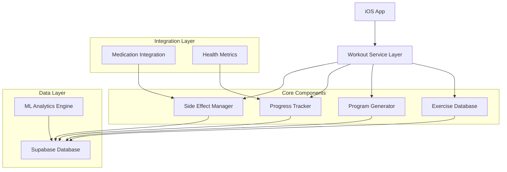

# Design Document: GLP-1 Optimized Workout System

## Overview

The GLP-1 Optimized Workout System is a comprehensive fitness module designed specifically for users taking GLP-1 receptor agonists. The system addresses the unique physiological challenges of GLP-1 therapy through clinically-optimized exercise protocols, intelligent side effect management, and ML-ready data structures for personalized recommendations.

The system integrates seamlessly with the existing fitness app infrastructure, leveraging the current Supabase backend and iOS SwiftUI frontend while introducing specialized workout models, exercise databases, and adaptive programming logic.

## Architecture

### High-Level System Architecture



### Component Responsibilities

- **Exercise Database**: Stores comprehensive exercise library with GLP-1-specific modifications
- **Program Generator**: Creates and adapts 4-day upper/lower split programs based on user profile
- **Progress Tracker**: Monitors performance, calculates progressive overload, tracks tonnage
- **Side Effect Manager**: Adapts workouts based on real-time side effect reporting
- **ML Analytics Engine**: Processes workout data for personalized recommendations

## Components and Interfaces

### 1. Database Schema Extensions

#### Exercise Library Tables

```sql
-- Master exercise library
CREATE TABLE exercise_library (
    id UUID PRIMARY KEY DEFAULT uuid_generate_v4(),
    name TEXT NOT NULL,
    category TEXT NOT NULL, -- compound, isolation, cardio
    movement_pattern TEXT NOT NULL, -- squat, hinge, push, pull, carry
    primary_muscles JSONB NOT NULL, -- ["chest", "triceps", "shoulders"]
    secondary_muscles JSONB,
    equipment_required JSONB, -- ["barbell", "bench"]
    difficulty_level INTEGER NOT NULL CHECK (difficulty_level BETWEEN 1 AND 5),
    intensity_score DECIMAL NOT NULL, -- ML feature for intensity rating
    recovery_demand INTEGER NOT NULL CHECK (recovery_demand BETWEEN 1 AND 5),
    glp1_compatibility_score DECIMAL NOT NULL, -- Suitability for GLP-1 users
    form_instructions TEXT NOT NULL,
    safety_warnings TEXT,
    breathing_technique TEXT,
    common_mistakes JSONB,
    progressions JSONB, -- Easier/harder variations
    contraindications JSONB, -- Medical conditions to avoid
    created_at TIMESTAMP WITH TIME ZONE DEFAULT NOW(),
    updated_at TIMESTAMP WITH TIME ZONE DEFAULT NOW()
);

-- GLP-1 specific exercise modifications
CREATE TABLE exercise_modifications (
    id UUID PRIMARY KEY DEFAULT uuid_generate_v4(),
    exercise_id UUID REFERENCES exercise_library(id) ON DELETE CASCADE,
    side_effect_type TEXT NOT NULL, -- fatigue, nausea, joint_pain, constipation
    modification_type TEXT NOT NULL, -- substitute, reduce_intensity, skip
    alternative_exercise_id UUID REFERENCES exercise_library(id),
    intensity_reduction DECIMAL, -- Percentage reduction
    modification_notes TEXT,
    created_at TIMESTAMP WITH TIME ZONE DEFAULT NOW()
);

-- User workout programs
CREATE TABLE workout_programs (
    id UUID PRIMARY KEY DEFAULT uuid_generate_v4(),
    user_id UUID REFERENCES users(id) ON DELETE CASCADE,
    program_name TEXT NOT NULL,
    program_type TEXT NOT NULL DEFAULT 'upper_lower_4day',
    fitness_level TEXT NOT NULL, -- beginner, intermediate, advanced
    start_date DATE NOT NULL,
    end_date DATE,
    is_active BOOLEAN DEFAULT TRUE,
    program_data JSONB NOT NULL, -- Structured program configuration
    created_at TIMESTAMP WITH TIME ZONE DEFAULT NOW(),
    updated_at TIMESTAMP WITH TIME ZONE DEFAULT NOW()
);

-- Individual workout sessions
CREATE TABLE workout_sessions (
    id UUID PRIMARY KEY DEFAULT uuid_generate_v4(),
    user_id UUID REFERENCES users(id) ON DELETE CASCADE,
    program_id UUID REFERENCES workout_programs(id) ON DELETE CASCADE,
    session_name TEXT NOT NULL, -- "Upper Push", "Lower Quad", etc.
    session_type TEXT NOT NULL, -- upper_push, lower_quad, upper_pull, lower_hinge
    scheduled_date DATE NOT NULL,
    completed_date DATE,
    duration_minutes INTEGER,
    perceived_exertion INTEGER CHECK (perceived_exertion BETWEEN 1 AND 10),
    side_effects_reported JSONB, -- ["fatigue", "nausea"]
    session_notes TEXT,
    status TEXT DEFAULT 'scheduled', -- scheduled, in_progress, completed, skipped
    created_at TIMESTAMP WITH TIME ZONE DEFAULT NOW(),
    updated_at TIMESTAMP WITH TIME ZONE DEFAULT NOW()
);

-- Exercise sets within workout sessions
CREATE TABLE workout_sets (
    id UUID PRIMARY KEY DEFAULT uuid_generate_v4(),
    session_id UUID REFERENCES workout_sessions(id) ON DELETE CASCADE,
    exercise_id UUID REFERENCES exercise_library(id) ON DELETE CASCADE,
    set_number INTEGER NOT NULL,
    prescribed_reps INTEGER,
    actual_reps INTEGER,
    prescribed_weight DECIMAL,
    actual_weight DECIMAL,
    rest_seconds INTEGER,
    rpe INTEGER CHECK (rpe BETWEEN 1 AND 10), -- Rate of Perceived Exertion
    form_rating INTEGER CHECK (form_rating BETWEEN 1 AND 5),
    notes TEXT,
    completed_at TIMESTAMP WITH TIME ZONE,
    created_at TIMESTAMP WITH TIME ZONE DEFAULT NOW()
);

-- User exercise progress tracking
CREATE TABLE exercise_progress (
    id UUID PRIMARY KEY DEFAULT uuid_generate_v4(),
    user_id UUID REFERENCES users(id) ON DELETE CASCADE,
    exercise_id UUID REFERENCES exercise_library(id) ON DELETE CASCADE,
    date DATE NOT NULL,
    max_weight DECIMAL,
    max_reps INTEGER,
    estimated_1rm DECIMAL,
    volume_load DECIMAL, -- sets × reps × weight
    personal_record BOOLEAN DEFAULT FALSE,
    created_at TIMESTAMP WITH TIME ZONE DEFAULT NOW(),
    UNIQUE(user_id, exercise_id, date)
);

-- Side effect impact tracking
CREATE TABLE side_effect_logs (
    id UUID PRIMARY KEY DEFAULT uuid_generate_v4(),
    user_id UUID REFERENCES users(id) ON DELETE CASCADE,
    session_id UUID REFERENCES workout_sessions(id),
    side_effect_type TEXT NOT NULL,
    severity INTEGER CHECK (severity BETWEEN 1 AND 5),
    impact_on_workout TEXT, -- none, mild, moderate, severe, prevented_workout
    medication_timing_hours INTEGER, -- Hours since last GLP-1 injection
    mitigation_used TEXT, -- What modification was applied
    timestamp TIMESTAMP WITH TIME ZONE DEFAULT NOW()
);
```

#### Indexes for Performance

```sql
CREATE INDEX idx_exercise_library_category ON exercise_library(category);
CREATE INDEX idx_exercise_library_movement_pattern ON exercise_library(movement_pattern);
CREATE INDEX idx_exercise_library_difficulty ON exercise_library(difficulty_level);
CREATE INDEX idx_workout_sessions_user_date ON workout_sessions(user_id, scheduled_date);
CREATE INDEX idx_workout_sets_session_exercise ON workout_sets(session_id, exercise_id);
CREATE INDEX idx_exercise_progress_user_exercise ON exercise_progress(user_id, exercise_id);
CREATE INDEX idx_side_effect_logs_user_timestamp ON side_effect_logs(user_id, timestamp);
```

### 2. iOS Model Layer

#### Core Exercise Models

```swift
// Exercise Library Model
struct Exercise: Identifiable, Codable {
    let id: UUID
    let name: String
    let category: ExerciseCategory
    let movementPattern: MovementPattern
    let primaryMuscles: [MuscleGroup]
    let secondaryMuscles: [MuscleGroup]
    let equipmentRequired: [Equipment]
    let difficultyLevel: Int // 1-5
    let intensityScore: Double // ML feature
    let recoveryDemand: Int // 1-5
    let glp1CompatibilityScore: Double
    let formInstructions: String
    let safetyWarnings: String?
    let breathingTechnique: String?
    let commonMistakes: [String]
    let progressions: ExerciseProgressions
    let contraindications: [String]
    
    // Computed properties for UI
    var difficultyText: String {
        switch difficultyLevel {
        case 1: return "Beginner"
        case 2: return "Novice"
        case 3: return "Intermediate"
        case 4: return "Advanced"
        case 5: return "Expert"
        default: return "Unknown"
        }
    }
    
    var intensityColor: Color {
        switch intensityScore {
        case 0..<0.3: return .green
        case 0.3..<0.7: return .orange
        default: return .red
        }
    }
}

enum ExerciseCategory: String, CaseIterable, Codable {
    case compound = "compound"
    case isolation = "isolation"
    case cardio = "cardio"
    case flexibility = "flexibility"
    case core = "core"
    
    var icon: String {
        switch self {
        case .compound: return "figure.strengthtraining.traditional"
        case .isolation: return "figure.strengthtraining.functional"
        case .cardio: return "figure.run"
        case .flexibility: return "figure.yoga"
        case .core: return "figure.core.training"
        }
    }
}

enum MovementPattern: String, CaseIterable, Codable {
    case squat = "squat"
    case hinge = "hinge"
    case push = "push"
    case pull = "pull"
    case carry = "carry"
    case rotation = "rotation"
    case gait = "gait"
    
    var description: String {
        switch self {
        case .squat: return "Knee-dominant movement"
        case .hinge: return "Hip-dominant movement"
        case .push: return "Pressing movement"
        case .pull: return "Pulling movement"
        case .carry: return "Loaded carry"
        case .rotation: return "Rotational movement"
        case .gait: return "Walking/running pattern"
        }
    }
}

enum MuscleGroup: String, CaseIterable, Codable {
    case chest = "chest"
    case shoulders = "shoulders"
    case triceps = "triceps"
    case biceps = "biceps"
    case back = "back"
    case lats = "lats"
    case traps = "traps"
    case quads = "quads"
    case hamstrings = "hamstrings"
    case glutes = "glutes"
    case calves = "calves"
    case core = "core"
    case forearms = "forearms"
    
    var icon: String {
        switch self {
        case .chest: return "figure.strengthtraining.traditional"
        case .shoulders: return "figure.arms.open"
        case .triceps, .biceps: return "arm"
        case .back, .lats, .traps: return "figure.strengthtraining.functional"
        case .quads, .hamstrings, .glutes, .calves: return "figure.walk"
        case .core: return "figure.core.training"
        case .forearms: return "hand.raised"
        }
    }
}

struct ExerciseProgressions: Codable {
    let easier: [UUID] // Exercise IDs for easier variations
    let harder: [UUID] // Exercise IDs for harder variations
    let equipment: [UUID] // Equipment-based alternatives
}
```

#### Workout Program Models

```swift
struct WorkoutProgram: Identifiable, Codable {
    let id: UUID
    let userId: UUID
    let programName: String
    let programType: ProgramType
    let fitnessLevel: FitnessLevel
    let startDate: Date
    let endDate: Date?
    let isActive: Bool
    let programData: ProgramConfiguration
    
    var currentWeek: Int {
        let calendar = Calendar.current
        let weeksSinceStart = calendar.dateComponents([.weekOfYear], from: startDate, to: Date()).weekOfYear ?? 0
        return max(1, weeksSinceStart + 1)
    }
    
    var progressPercentage: Double {
        guard let endDate = endDate else { return 0.0 }
        let totalDuration = endDate.timeIntervalSince(startDate)
        let elapsed = Date().timeIntervalSince(startDate)
        return min(1.0, max(0.0, elapsed / totalDuration))
    }
}

enum ProgramType: String, CaseIterable, Codable {
    case upperLower4Day = "upper_lower_4day"
    case fullBody3Day = "full_body_3day"
    case pushPullLegs = "push_pull_legs"
    case custom = "custom"
    
    var description: String {
        switch self {
        case .upperLower4Day: return "4-Day Upper/Lower Split"
        case .fullBody3Day: return "3-Day Full Body"
        case .pushPullLegs: return "Push/Pull/Legs"
        case .custom: return "Custom Program"
        }
    }
    
    var sessionsPerWeek: Int {
        switch self {
        case .upperLower4Day: return 4
        case .fullBody3Day: return 3
        case .pushPullLegs: return 6
        case .custom: return 0
        }
    }
}

enum FitnessLevel: String, CaseIterable, Codable {
    case beginner = "beginner"
    case intermediate = "intermediate"
    case advanced = "advanced"
    
    var volumeMultiplier: Double {
        switch self {
        case .beginner: return 0.8
        case .intermediate: return 1.0
        case .advanced: return 1.2
        }
    }
    
    var intensityRange: ClosedRange<Double> {
        switch self {
        case .beginner: return 0.65...0.75
        case .intermediate: return 0.70...0.80
        case .advanced: return 0.75...0.85
        }
    }
}

struct ProgramConfiguration: Codable {
    let sessionTemplates: [SessionTemplate]
    let progressionScheme: ProgressionScheme
    let deloadWeeks: [Int] // Week numbers for deload
    let adaptationRules: AdaptationRules
}

struct SessionTemplate: Identifiable, Codable {
    let id: UUID
    let name: String
    let type: SessionType
    let exercises: [ExerciseTemplate]
    let estimatedDuration: Int // minutes
    let targetRPE: Int // 1-10
}

enum SessionType: String, CaseIterable, Codable {
    case upperPush = "upper_push"
    case upperPull = "upper_pull"
    case lowerQuad = "lower_quad"
    case lowerHinge = "lower_hinge"
    case fullBody = "full_body"
    case cardio = "cardio"
    
    var displayName: String {
        switch self {
        case .upperPush: return "Upper Push"
        case .upperPull: return "Upper Pull"
        case .lowerQuad: return "Lower Quad"
        case .lowerHinge: return "Lower Hinge"
        case .fullBody: return "Full Body"
        case .cardio: return "Cardio"
        }
    }
    
    var icon: String {
        switch self {
        case .upperPush: return "arrow.up.circle.fill"
        case .upperPull: return "arrow.down.circle.fill"
        case .lowerQuad: return "figure.strengthtraining.traditional"
        case .lowerHinge: return "figure.strengthtraining.functional"
        case .fullBody: return "figure.strengthtraining.traditional"
        case .cardio: return "figure.run"
        }
    }
}

struct ExerciseTemplate: Identifiable, Codable {
    let id: UUID
    let exerciseId: UUID
    let order: Int
    let sets: Int
    let repRange: RepRange
    let restSeconds: Int
    let intensityPercentage: Double // % of 1RM
    let isOptional: Bool
    let notes: String?
}

struct RepRange: Codable {
    let min: Int
    let max: Int
    
    var description: String {
        return min == max ? "\(min)" : "\(min)-\(max)"
    }
}
```

#### Side Effect Management Models

```swift
struct SideEffectLog: Identifiable, Codable {
    let id: UUID
    let userId: UUID
    let sessionId: UUID?
    let sideEffectType: SideEffectType
    let severity: Int // 1-5
    let impactOnWorkout: WorkoutImpact
    let medicationTimingHours: Int?
    let mitigationUsed: String?
    let timestamp: Date
}

enum SideEffectType: String, CaseIterable, Codable {
    case fatigue = "fatigue"
    case nausea = "nausea"
    case dizziness = "dizziness"
    case jointPain = "joint_pain"
    case constipation = "constipation"
    case headache = "headache"
    case muscleWeakness = "muscle_weakness"
    
    var displayName: String {
        switch self {
        case .fatigue: return "Fatigue"
        case .nausea: return "Nausea"
        case .dizziness: return "Dizziness"
        case .jointPain: return "Joint Pain"
        case .constipation: return "Constipation"
        case .headache: return "Headache"
        case .muscleWeakness: return "Muscle Weakness"
        }
    }
    
    var icon: String {
        switch self {
        case .fatigue: return "battery.25"
        case .nausea: return "stomach"
        case .dizziness: return "head.profile.arrow.forward.and.arrow.backward"
        case .jointPain: return "figure.walk.motion"
        case .constipation: return "stomach.fill"
        case .headache: return "brain.head.profile"
        case .muscleWeakness: return "figure.strengthtraining.traditional"
        }
    }
    
    var workoutModifications: [WorkoutModification] {
        switch self {
        case .fatigue:
            return [.reduceIntensity(0.15), .shortenSession(0.25), .increasedRest(1.5)]
        case .nausea:
            return [.avoidAbdominalStrain, .preferSeated, .reduceIntensity(0.20)]
        case .dizziness:
            return [.avoidValsalva, .preferSeated, .reduceIntensity(0.25)]
        case .jointPain:
            return [.lowImpactAlternatives, .reducedRangeOfMotion, .machinePreference]
        case .constipation:
            return [.addCardio(15), .emphasizeCore]
        case .headache:
            return [.avoidValsalva, .reduceIntensity(0.20), .shortenSession(0.30)]
        case .muscleWeakness:
            return [.reduceIntensity(0.25), .assistedVariations, .machinePreference]
        }
    }
}

enum WorkoutImpact: String, CaseIterable, Codable {
    case none = "none"
    case mild = "mild"
    case moderate = "moderate"
    case severe = "severe"
    case preventedWorkout = "prevented_workout"
    
    var color: Color {
        switch self {
        case .none: return .green
        case .mild: return .yellow
        case .moderate: return .orange
        case .severe: return .red
        case .preventedWorkout: return .purple
        }
    }
}

enum WorkoutModification: Equatable {
    case reduceIntensity(Double) // Percentage reduction
    case shortenSession(Double) // Percentage reduction
    case increasedRest(Double) // Multiplier
    case avoidAbdominalStrain
    case preferSeated
    case avoidValsalva
    case lowImpactAlternatives
    case reducedRangeOfMotion
    case machinePreference
    case addCardio(Int) // Additional minutes
    case emphasizeCore
    case assistedVariations
    
    var description: String {
        switch self {
        case .reduceIntensity(let percent):
            return "Reduce intensity by \(Int(percent * 100))%"
        case .shortenSession(let percent):
            return "Shorten session by \(Int(percent * 100))%"
        case .increasedRest(let multiplier):
            return "Increase rest by \(Int((multiplier - 1) * 100))%"
        case .avoidAbdominalStrain:
            return "Avoid exercises requiring abdominal strain"
        case .preferSeated:
            return "Prefer seated exercise variations"
        case .avoidValsalva:
            return "Avoid breath-holding techniques"
        case .lowImpactAlternatives:
            return "Use low-impact exercise alternatives"
        case .reducedRangeOfMotion:
            return "Use reduced range of motion"
        case .machinePreference:
            return "Prefer machine-based exercises"
        case .addCardio(let minutes):
            return "Add \(minutes) minutes of light cardio"
        case .emphasizeCore:
            return "Emphasize core strengthening"
        case .assistedVariations:
            return "Use assisted exercise variations"
        }
    }
}
```

### 3. Service Layer Architecture

#### Workout Service Interface

```swift
protocol WorkoutServiceProtocol {
    // Program Management
    func createProgram(for user: User, type: ProgramType, level: FitnessLevel) async throws -> WorkoutProgram
    func getActiveProgram(for userId: UUID) async throws -> WorkoutProgram?
    func updateProgram(_ program: WorkoutProgram) async throws
    
    // Session Management
    func getUpcomingSession(for userId: UUID) async throws -> WorkoutSession?
    func startSession(_ sessionId: UUID) async throws
    func completeSession(_ sessionId: UUID, duration: Int, rpe: Int, notes: String?) async throws
    
    // Exercise Management
    func getExerciseLibrary(filteredBy category: ExerciseCategory?) async throws -> [Exercise]
    func getExerciseDetails(_ exerciseId: UUID) async throws -> Exercise
    func getExerciseModifications(for exerciseId: UUID, sideEffect: SideEffectType) async throws -> [ExerciseModification]
    
    // Progress Tracking
    func recordSet(_ set: WorkoutSet) async throws
    func getProgressHistory(for userId: UUID, exerciseId: UUID) async throws -> [ExerciseProgress]
    func calculateEstimated1RM(weight: Double, reps: Int) -> Double
    
    // Side Effect Management
    func reportSideEffect(_ sideEffect: SideEffectLog) async throws
    func getWorkoutModifications(for sideEffects: [SideEffectType], severity: Int) async throws -> [WorkoutModification]
    func adaptSession(_ sessionId: UUID, modifications: [WorkoutModification]) async throws
}
```

## Data Models

### Exercise Database Structure

The exercise database will contain approximately 100+ exercises covering all movement patterns and muscle groups, with specific focus on the GLP-1 protocol requirements:

#### Compound Movements (Priority Exercises)
- **Upper Push**: Bench Press, Overhead Press, Incline Press, Dips
- **Upper Pull**: Pull-ups, Rows, Lat Pulldowns, Face Pulls
- **Lower Quad**: Squats, Leg Press, Lunges, Step-ups
- **Lower Hinge**: Romanian Deadlifts, Hip Thrusts, Good Mornings

#### Isolation Movements
- **Arms**: Bicep Curls, Tricep Extensions, Lateral Raises
- **Legs**: Leg Extensions, Hamstring Curls, Calf Raises
- **Core**: Planks, Dead Bugs, Bird Dogs

#### GLP-1 Specific Modifications
Each exercise includes modifications for common side effects:
- **Fatigue**: Reduced intensity versions, machine alternatives
- **Nausea**: Seated variations, avoiding forward bending
- **Joint Pain**: Low-impact alternatives, reduced range of motion
- **Dizziness**: Avoiding breath-holding, seated positions

### ML Feature Engineering

The system will collect rich data for machine learning algorithms:

#### Exercise Features
- Intensity Score (0-1): Calculated from load, volume, and complexity
- Recovery Demand (1-5): Based on muscle groups, movement complexity
- Adherence Score (0-1): Historical completion rates
- Effectiveness Score (0-1): Progress per unit effort

#### User Features
- Medication Timing: Hours since last injection
- Side Effect Profile: Historical patterns and severity
- Fitness Level Progression: Dynamic assessment based on performance
- Preference Weights: Learned from exercise selection patterns

#### Session Features
- RPE Trends: Rate of perceived exertion over time
- Volume Load: Sets × Reps × Weight progression
- Adherence Patterns: Completion rates by day/time
- Modification Frequency: How often adaptations are needed

## Error Handling

### Exercise Safety Protocols
1. **Form Validation**: Real-time feedback on exercise execution
2. **Load Progression Limits**: Automatic caps on weight increases
3. **Fatigue Detection**: RPE monitoring with automatic deload triggers
4. **Medical Contraindications**: Exercise filtering based on health conditions

### Side Effect Response System
1. **Immediate Adaptation**: Real-time workout modifications
2. **Pattern Recognition**: Learning from historical side effect data
3. **Escalation Protocols**: Recommendations for medical consultation
4. **Recovery Tracking**: Monitoring return to baseline function

### Data Integrity
1. **Sync Conflict Resolution**: Handling offline/online data conflicts
2. **Progress Validation**: Detecting and correcting unrealistic progress claims
3. **Backup and Recovery**: Ensuring workout history preservation
4. **Privacy Protection**: Anonymizing sensitive health data for ML

## Testing Strategy

### Unit Testing
- Exercise database queries and filtering
- Progressive overload calculations
- Side effect modification logic
- ML feature extraction functions

### Integration Testing
- Supabase database operations
- Real-time sync between iOS and backend
- Medication integration workflows
- Progress tracking accuracy

### User Acceptance Testing
- Workout flow usability
- Side effect reporting and adaptation
- Progress visualization
- Exercise form instruction clarity

### Performance Testing
- Database query optimization
- Large dataset handling (1000+ exercises)
- Real-time modification calculations
- Offline functionality

### Clinical Validation Testing
- Exercise prescription accuracy
- Side effect modification effectiveness
- Safety protocol validation
- Medical professional review

The design ensures a robust, scalable, and clinically-sound workout system that addresses the unique needs of GLP-1 users while providing rich data for continuous improvement through machine learning.